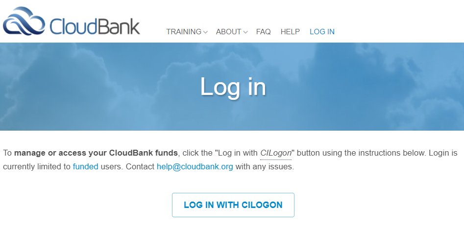
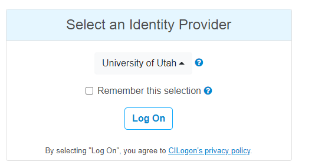
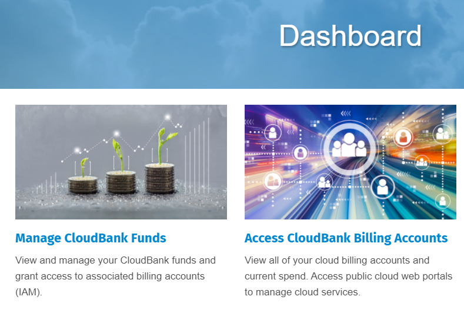
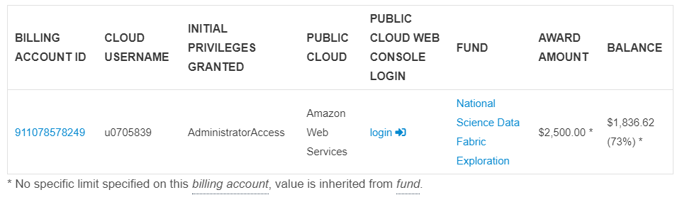

# NSDF-Cloud Examples


##  AWS Machines

With GPU-capabilities see:
- https://aws.amazon.com/marketplace/pp/prodview-sqyimxk7y2ibs
- https://aws.amazon.com/it/ec2/instance-types/g4/

```
# CPU
# c5d.4xlarge	     $0.76 -  16 vCPUs 32.0 GiB	400 GB NVMe SSD	<=10 Gigabit	
# c5d.9xlarge	     $1.72 -  36 vCPUs 72.0 GiB	900 GB NVMe SSD	  10 Gigabit

# GPU
# p3.2xlarge         $3.06 -  8 vCPUs -   61GiB -  1xV100 - EBS only
# p3.8xlarge        $12.24 - 32 vCPUs -  244GiB -  4xV100 - EBS only
# p3.16xlarge       $24.48 - 64 vCPUs -  488GiB -  8xV100 - EBS only
# p3dn.24xlarge     $31.21 - 96 vCPUs -  768GiB  - 8xV100 - 1800GiB

# g4dn.xlarge       $0.526  - 4 vCPUs -  16GiB -  1xT4 -  125GB EBS AND SSD # reccomended
# g4dn.2xlarge      $0.752    
# g4dn.4xlarge      $1.204    
# g4dn.8xlarge      $2.176    
# g4dn.12xlarge     $3.912    
# g4dn.16xlarge     $4.352

# g5.xlarge        $1.006
# g5.2xlarge       $1.212
# g5.4xlarge       $1.624
# g5.8xlarge       $2.448
# g5.12xlarge      $5.672
# g5.16xlarge      $4.096
# g5.24xlarge      $8.144
# g5.48xlarge     $16.288 - 192 vCPU - 768GiB - 8xA10G - 7600 GiB EBS and SSD
```

Create Ec2 instances:

```
ACCOUNT=nsdf-cloud-aws
AWS_DEFAULT_REGION=us-east-1
INSTANCE_TYPE=t2.micro
python3 -m nsdf.cloud nsdf-cloud-aws create nodes test1 --instance-type $INSTANCE_TYPE --region $AWS_DEFAULT_REGION  --num 1

INSTANCE_TYPE=c5d.9xlarge
python3 -m nsdf.cloud nsdf-cloud-aws create nodes test1 --instance-type $INSTANCE_TYPE --region $AWS_DEFAULT_REGION  --num 1
```

List all instances with name `test1`:

```
python3 -m nsdf.cloud nsdf-cloud-aws get nodes test1 --region $AWS_DEFAULT_REGION

```

Create ansible inventory:

```
python3 -m nsdf.cloud $ACCOUNT create inventory test1 
```

Destroy nodes:

```
python3 -m nsdf.cloud nsdf-cloud-aws delete nodes test1 --region $AWS_DEFAULT_REGION
```


Get all AWS regions:

```
python3 -m nsdf.cloud nsdf-cloud-aws get regions
```

Get VPCs in one region:

```
python3 -m nsdf.cloud nsdf-cloud-aws get vpcs --region $AWS_DEFAULT_REGION
```


If you want to **list all instances in all regions** (note: you could have some errors due to disabled regions):

```
python3 -m pip install --upgrade awscli

source $(python -m nsdf.value )


# insert your credentials here
export AWS_ACCESS_KEY_ID=XXXXX
export AWS_SECRET_ACCESS_KEY=YYYYY
unset AWS_DEFAULT_REGION
export AWS_ENDPOINT_URL=https://ec2.amazonaws.com

REGIONS=$(aws ec2 describe-regions --all-regions  --query "Regions[].{Name:RegionName}"  --output text)

for region in $REGIONS; do
   echo "region=$region"
   aws ec2 --region $region  describe-instances --filters Name=instance-state-name,Values=running
done
```

If you want to list the `Ubuntu` images:

```
aws ec2 describe-images --region $AWS_DEFAULT_REGION --filters "Name=description,Values=*ubuntu-20.0*"
```


# AWS First time setup

Login into https://www.cloudbank.org/user/login with *CILogon*



Select your identity provider and click *Log on*. Follow your institutions instructions to complete the operation.



On the dashboard select *Access CloudBank Billing Accounts*.



Click on *login* in the billing account access.



## Create user

Go to the [IAM service](https://console.aws.amazon.com/iamv2/) and in the `Users` section add the `nsdf-automation`user with`Admininstrator` permissions (**NOTE: this is an unsafe procedure**)

```
CREDENTIAL TYPE: programmatic access
ACCESS: "Administrator Full Access"
POLICY:
{
    "Version": "2012-10-17",
    "Statement": [
        {
            "Effect": "Allow",
            "Action": "*",
            "Resource": "*"
        }
    ]
}
```

## Create Access Key

Click on *Security credentials* and *Create Accesss key*.

Take note of the `Access Key Id` and `Secret Access Key`. **Also remember to activate/deactivate it to avoid security problems**


## Create and import SSH key

If not already generated , generate a new `id_nsdf` SSH key with an empty passphrase:

```
if [ ! -f ~/.ssh/id_nsdf ] ; then
  ssh-keygen -t rsa -f ~/.ssh/id_nsdf -N ""
fi
```

Go to *EC2* section and select *Actions/Import Key pair*:

* Name: `id_nsdf`
* Text: *copy here your public key*


## Update your `vault.yaml` file

Create a new item to your Vault file (i.e., `~/.nsdf/vault/vault.yaml`). Change values as needed:

```
nsdf-cloud-aws:  class: AmazonEC2
  access-key: XXXXX
  secret-access-key: YYYYY
  region: us-east-1
  instance-type: t2.micro
  num: 1
  image-id: ami-09e67e426f25ce0d7 # this is ubuntu20
  cidr-block: 172.16.0.0/16
  ssh-username: ubuntu
  ssh-key-name: id_nsdf
  ssh-key-filename: ~/.ssh/id_nsdf
```


